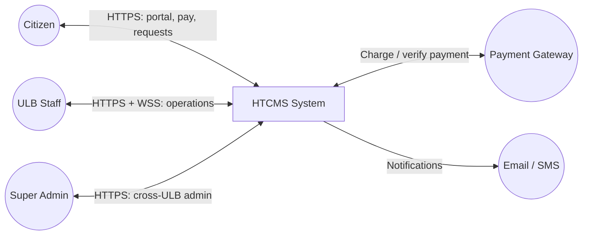
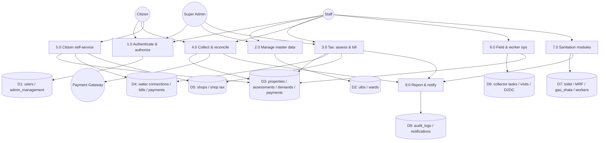
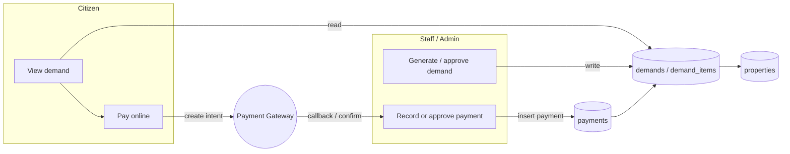
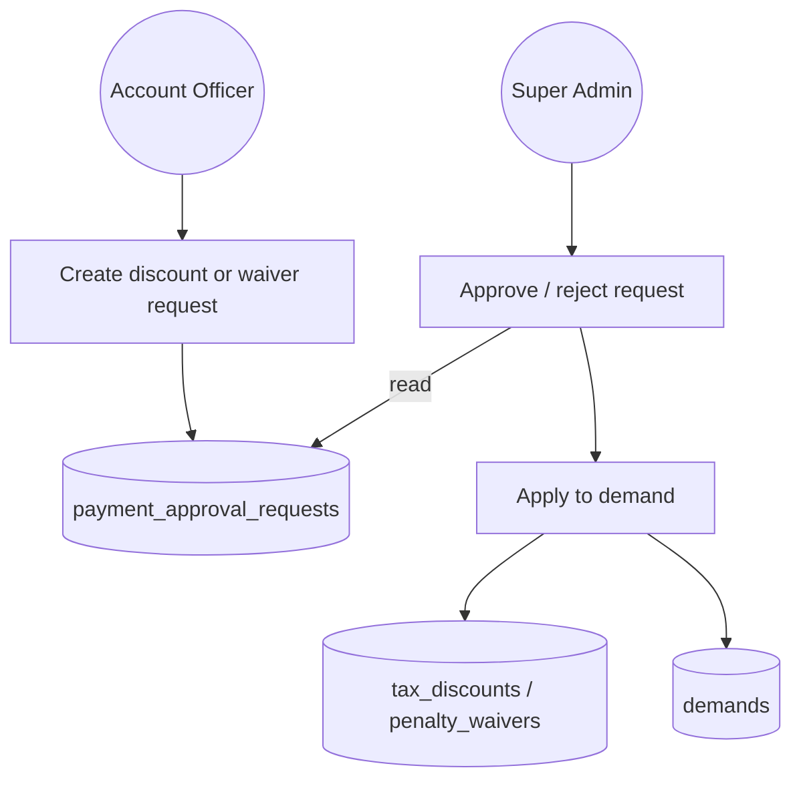
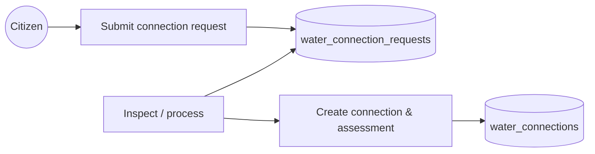

# HTCMS — Data flow diagrams (DFD)

Convention used below:

- **External entities**: Citizen, Staff, Super Admin, Payment gateway, Email service  
- **Processes**: numbered bubbles  
- **Data stores**: D1, D2, … (map to PostgreSQL tables/groups)  
- **Flows**: labeled arrows  

> Diagrams use **Mermaid** syntax. Render in [mermaid.live](https://mermaid.live) or any Mermaid-compatible tool, then export for PowerPoint.

---

## DFD Level 0 (context diagram)

Single system process: **HTCMS**.

**Narration for slides:** All external actors interact only with HTCMS; the system owns business rules and persistence; payments and messaging go through external providers.

---

## DFD Level 1 — Major processes

Decompose HTCMS into logical subsystems (aligned with modules in code).

---

## DFD Level 2 — Example: Demand → Payment (property tax)

---

## DFD Level 2 — Example: Discount / penalty waiver approval

This matches backend messaging: Account Officer submits; **only Super Admin** approves/rejects in `paymentApprovalRequest.controller.js`.

---

## DFD Level 2 — Example: Citizen water connection request

(Exact steps depend on Clerk/Inspector/Officer involvement; entities are in `WaterConnectionRequest` model.)

---

## Tabular mapping: data stores → DB groups

| Store ID | Tables (representative) |
|----------|-------------------------|
| D1 | `users`, `admin_management` |
| D2 | `ulbs`, `wards` |
| D3 | `properties`, `assessments`, `demands`, `demand_items`, `payments`, `notices`, `penalty_rules`, `tax_discounts`, `penalty_waivers`, `payment_approval_requests` |
| D4 | `water_connections`, `water_bills`, `water_payments`, `water_tax_assessments`, `water_connection_requests` |
| D5 | `shops`, `shop_tax_assessments`, `shop_registration_requests` |
| D6 | `collector_tasks`, `field_visits`, `follow_ups`, `collector_attendance`, `d2dc_records` |
| D7 | Toilet/MRF/Gau Shala/Worker tables |
| D8 | `audit_logs`, `notifications`, `alerts` |

---

## How to use in a PPT

1. **Slide 1**: Level 0 context (actors + HTCMS).  
2. **Slide 2**: Level 1 decomposition (processes 1.0–8.0).  
3. **Slide 3–5**: Level 2 for **payment**, **approval workflow**, and **citizen request** (pick what your audience cares about).  
